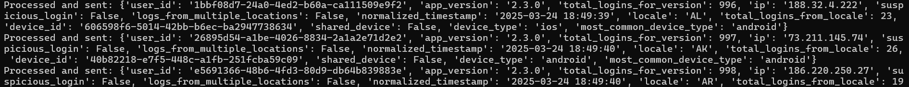
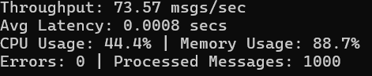

# Kafka Real Time Data Streaming Pipeline

## Overview:

This is a real-time streaming data pipeline built using Apache Kafka to consume, process, and produce user login events. The pipeline ensures efficient, scalable, and fault-tolerant data streaming by leveraging Kafka Consumer Groups, message compression, batch processing, and monitoring mechanisms. This pipeline is capable of:
- Continuously ingesting data from a Kafka Topic (user-login)
- Performing real-time data transformations such as filtering, aggregation, and extraction of insights.
- Storing the processed data into a new Kafka Topic (processed-user-login)

The aim of this pipeline is to simulate a real-time data stream and transform it before storing the transformed data for further analysis.

## Project Setup:

### Prerequisites:
- Install Docker Compose and Docker Desktop for your platform (Windows/MacOS/Linux) 
- Install Python 3.8 and add it to your system's path.
- Download Kafka binary file (.tgz or .tar file) from Kafka's official website

### Setup Instructions:
1. Verify that the prerequisites are properly installed.
2. Clone this repository and extract in local folder
3. Open docker desktop in background
4. Open Terminal/Command prompt
5. Navigate to local project folder in terminal/command prompt and enter "docker-compose up"
6. Duplicate terminal/command prompt tab and navigate to the local project folder
7. In the new tab, enter "pip install kafka-python"
8. After installation is complete, enter "python create_kafka_topic.py"
9. Next, enter "python create_kafka_consumer.py"
10. Monitor the output
11. Press 'Ctrl+C' to stop the messages
12. Go to docker and view the logs
13. Stop docker container

## Design Choices:

This design prioritizes scalability, efficiency, and fault tolerance to handle high-volume real-time login events.

Kafka as the core message broker ensures high throughput, fault tolerance, and distributed processing. I have used partitions to allow multiple consumers to process messages in parallel.

Snappy compression reduces network and storage overhead. Snappy also has fast decompression capability.

batch_size=16384 ensures messages are efficiently grouped before being sent.

linger_ms=5 introduces a small delay to batch messages together, improving throughput.

auto_offset_reset="earliest" ensures no messages are missed when a new consumer joins.

I have used multithreading approach for parallel processing.

The consumer processes each login event using the following transformations:

Filter Non-Mobile Devices: Only processes logins from Android and iOS devices.

Aggregate Logins by App Version: Tracks total logins per app version.

Detect Suspicious Login Behavior: Flags logins from multiple IPs per user.

Normalize Timestamps: Converts Unix timestamps to human-readable format.

Geo-Based Analysis & Shared Device Detection: Tracks logins per locale and detects devices shared by multiple users.

## Data Flow:

Producer -> Kafka -> Consumer -> Processed Data

1. User logins generate events, which the Kafka Producer sends to the user-login topic.
2. Kafka stores and partitions messages for distributed processing.
3. Kafka Consumer Group consumes events, applying transformation logic.
4. Processed events are published to the processed-user-login topic.
5. A downstream storage system (e.g., PostgreSQL, S3, or NoSQL) can store the processed data for further analysis.

## Message Format:

Raw Message:
 
{

    "user_id": "6ea37cd8-81e4-4583-aff1-3dc033af1361",
    "app_version": "2.3.0",
    "device_type": "Android",
    "ip": "50.160.200.36",
    "locale": "NC",
    "device_id": "2880cde2-9b02-4ca3-87d1-0ba2d16d7919",
    "timestamp": "1711302636"
}

Processed Message:

Processed and sent: 
{

    'user_id': '6ea37cd8-81e4-4583-aff1-3dc033af1361', 
    'app_version': '2.3.0', 
    'total_logins_for_version': 101, 
    'ip': '50.160.200.36', 
    'suspicious_login': False, 
    'logs_from_multiple_locations': False, 
    'normalized_timestamp': '2025-03-24 18:50:36', 
    'locale': 'NC', 
    'total_logins_from_locale': 5, 
    'device_id': '2880cde2-9b02-4ca3-87d1-0ba2d16d7919', 
    'shared_device': False, 
    'device_type': 'android', 
    'most_common_device_type': 'android'
}

## Processing Steps:
- Device Type Filtering - filter messages where device_type is 'android' or 'ios'
- Logins per App Version Aggregation - Calculates number of logins for each app version
- Suspicious Login detection - flags users logging in from multiple IPs
- Timestamp Normalization - Converts timestamps into UTC format
- Geo-based analysis - Counts logins per locale
- Device ID Analysis - Detects cases where multiple users log in with the same device_id
- Identifies most common device_type in real-time.

## Performance Enhancement:
- Batch Processing - messages are processed in batches to optimize throughput
- Multithreading & Parallelization: Implemented for efficient message processing
- Compression: Used Snappy for efficient data transmission
- Resource Monitoring - CPU and memory usage tracking feature
- Error Handling & Logging - Logs errors and invalid messages

## Benchmarking Metrics:

Resource Monitoring: Tracks CPU, memory, and latency to detect bottlenecks.

Throughput -  Messages processed/second

Latency - Average time taken to process a message

## Results in Terminal:

Attached above is a snippet of the output.
The parts of a single processed message are:
- user_id - User's unique identifier
- app_version - Version of the application the user is logging in 
- total_logins_for_version - Number of total logins recorded for given app version
- ip - User's IP address
- suspicious_login - True if the user has logged in from multiple different IP addresses
- logs_from_multiple_locations - True if the user has logged in from multiple different locations
- normalized_timestamp - The login timestamp converted from a Unix timestamp to UTC format
- locale - User's geographical location
- total_logins_from_locale - Total number of logins recorded form the user's locale
- device_id - Unique device identifier
- shared_device - True if multiple users have logged in from the same device_id
- device_type - Type of device beign used for login. Due to thefilteration criteria, only IOS or Android devices are processed
- most_common_device_type - Most frequently used device_type

Above are the performance characteristics of the output message. This gets displayed after processing every 100 messages.

## Insights:

## Additional information:

- How would you deploy this application in production?

We can deploy the containerized application on Kubernetes. Multiple Kafka brokers can be deployed instead of just one and topic can be replicated across these brokers for a distributed approach. Along with multiple brokers, we can also deploy multiple consumer instances and further partition the topics. This can be integrated with MongoDB or Amazon S3 for storage. For real-time monitoring of throughput and memory usage, Prometheus can be used. A CI/CD pipeline can be set up using Jenkins for automated testing and deployment. To ensure secure data transmission we can use OAuth2 Authentication as well.

- What other components would you want to add to make this production ready?

A Kafka manager can be introduced to monitor the system. Integration with database or cloud storage for data storage is necessary as well. Apache Spark can be used for more advanced real-time streaming and reducing latency.

- How can this application scale with a growing dataset?

The number of consumers can be increased or we can increase the number of partitions. Apart from this, we can use Apache Spark Streaming to reduce the latency. A load balancer can be used to efficiently distribute the traffic across the consumers. Additionally, it is beneficial to store the old, less frequent data in cold storage while keeping frequently accessed data in a database.